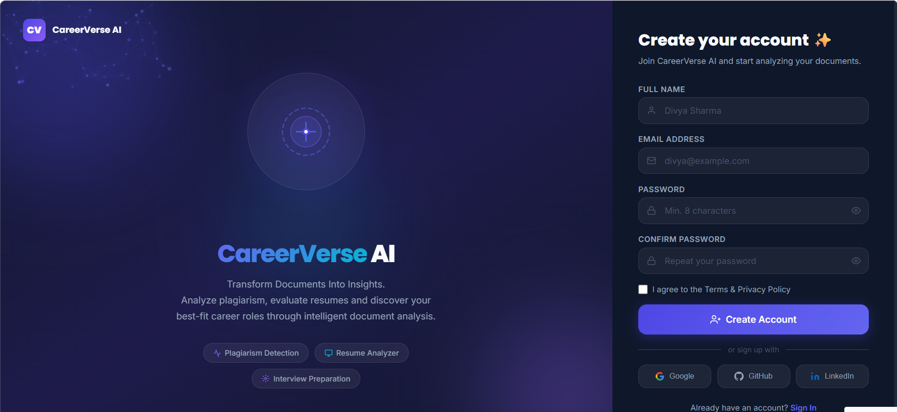
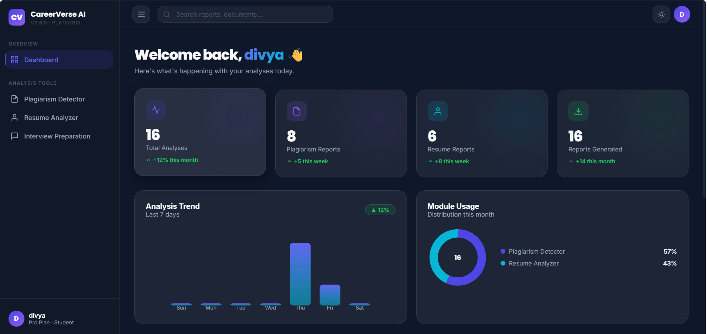
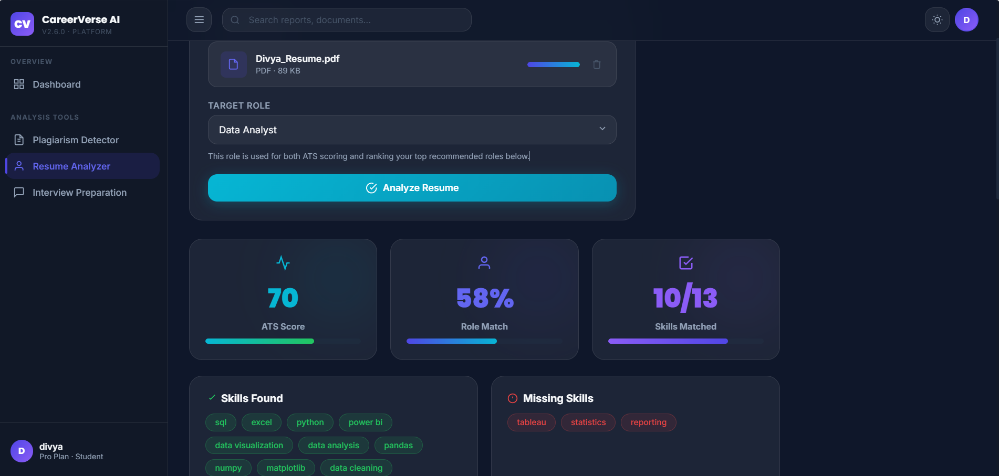
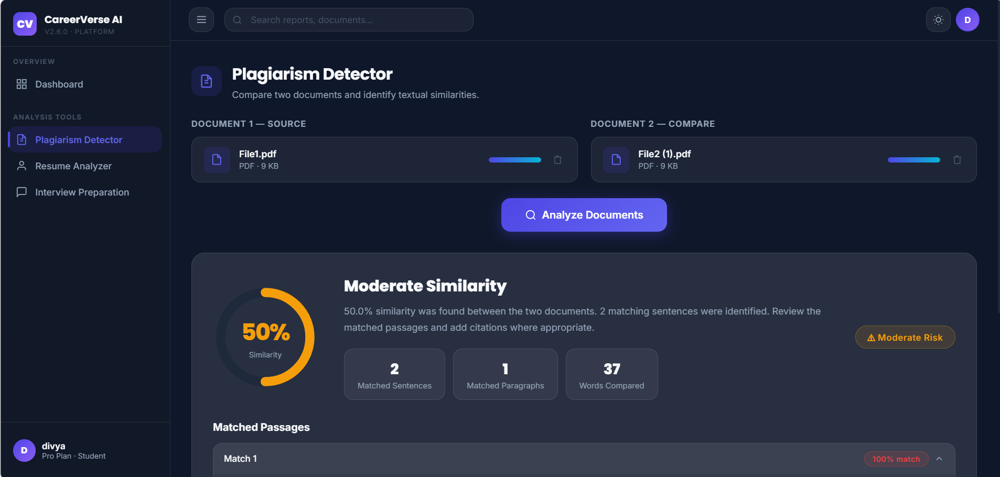
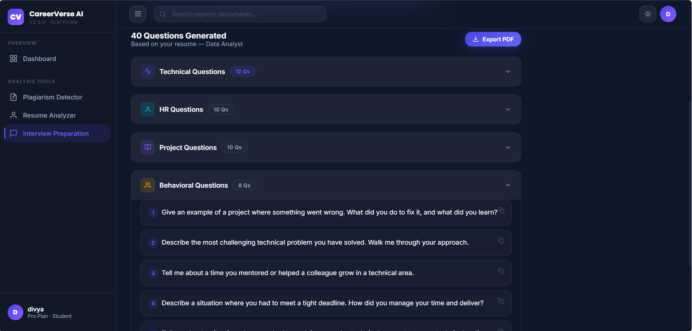
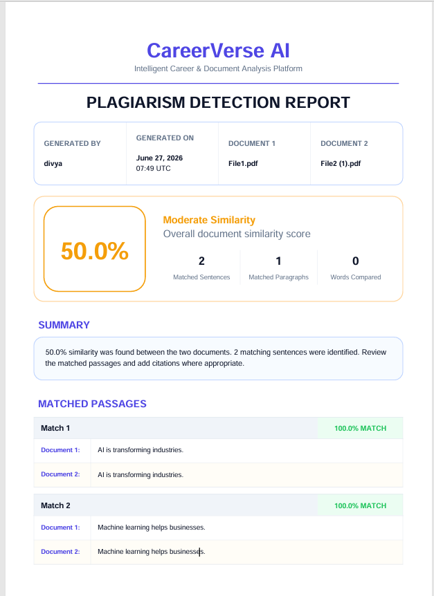

# 🚀 CareerVerse AI

> AI-Powered Career Intelligence Platform
> that helps users analyze resumes, detect plagiarism, and prepare for interviews using AI.

---

# 🎯 Problem Statement

Students and job seekers often rely on multiple platforms for resume evaluation, plagiarism detection, and interview preparation. CareerVerse AI brings these essential career development tools into one intelligent platform, providing AI-powered insights, personalized recommendations, and professional PDF reports to simplify the job preparation process.

---

# ✨ Features

### 📄 Resume Analyzer

* ATS Score Analysis
* Role Match Analysis
* Skill Extraction & Missing Skills Detection
* AI-based Career Recommendations
* Resume Improvement Suggestions
* Professional Resume PDF Report

### 📝 Plagiarism Detector

* Semantic Similarity Detection
* Sentence-Level Matching
* Duplicate Content Detection
* Professional Plagiarism PDF Report

### 💼 Interview Preparation

* Technical Questions
* HR Questions
* Project-Based Questions
* Behavioral Questions
* Professional Interview Preparation PDF

---

# ⭐ Key Highlights

* AI-powered Resume Analysis
* Semantic Plagiarism Detection using Sentence Transformers
* ATS Score & Role Match Analysis
* AI-generated Interview Questions
* Professional PDF Report Generation
* Secure User Authentication
* Interactive Dashboard

---

# 🛠 Tech Stack

### Backend

* Python
* Flask
* SQLAlchemy
* SQLite

### Machine Learning

* Sentence Transformers
* Scikit-learn
* NLTK

### Frontend

* HTML
* CSS
* JavaScript

### Reports

* ReportLab

---

# 📂 Project Structure

```text
CareerVerse-AI/
│
├── app.py
├── requirements.txt
├── README.md
├── database/
├── modules/
├── static/
├── templates/
├── uploads/
├── reports/
└── assets/
```

---

# ⚙ Installation

```bash
git clone https://github.com/YOUR_USERNAME/CareerVerse-AI.git

cd CareerVerse-AI

python -m venv venv

# Windows
venv\Scripts\activate

pip install -r requirements.txt

python app.py
```

Visit:

```text
http://127.0.0.1:5000
```

---

# 📸 Screenshots

## 🔐 Login Page



---

## 📊 Dashboard



---

## 📄 Resume Analyzer (ATS Score + AI Career Recommendations)



---

## 📝 Plagiarism Detector



---

## 💼 Interview Preparation



---

## 📑 Sample Plagiarism Report



---

# 🚀 Future Enhancements

* AI Resume Builder
* LinkedIn Profile Analyzer
* Mock Interview with Voice AI
* AI Career Roadmap Generator
* Resume Ranking System

---

# 👩‍💻 Developed By

**Divya K**

B.Tech – Data Science

CareerVerse AI

---

⭐ If you found this project useful, consider giving it a star on GitHub!
